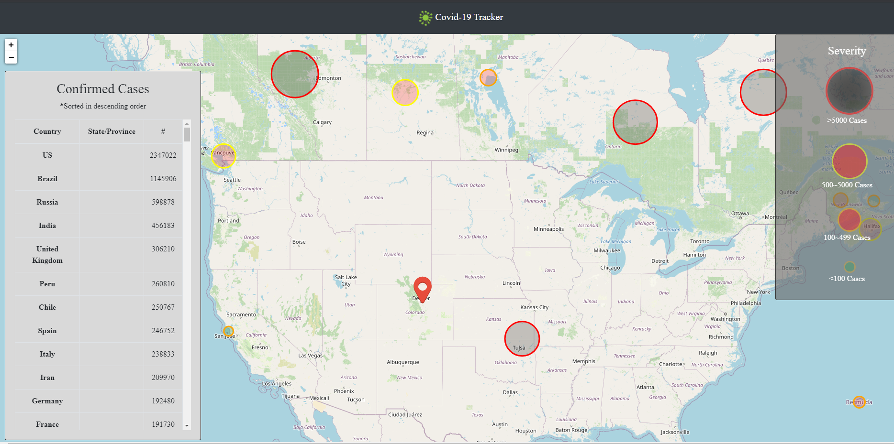

## Covid-19 Tracker


### Description

A quick project created to inform users of the Covid-19 cases around the world.

### Technology
- Spring Boot
- React
- Leaflet
- Bootstrap

### Development

###### Client-Side
- React 
- Leaflet for creating the map view 
- Bootstrap for styling.

###### Server-Side 
- Spring Boot to schedule cron jobs to fetch data every few hours



###### Live link
```html
https://tracking-corona-client.herokuapp.com/
```
